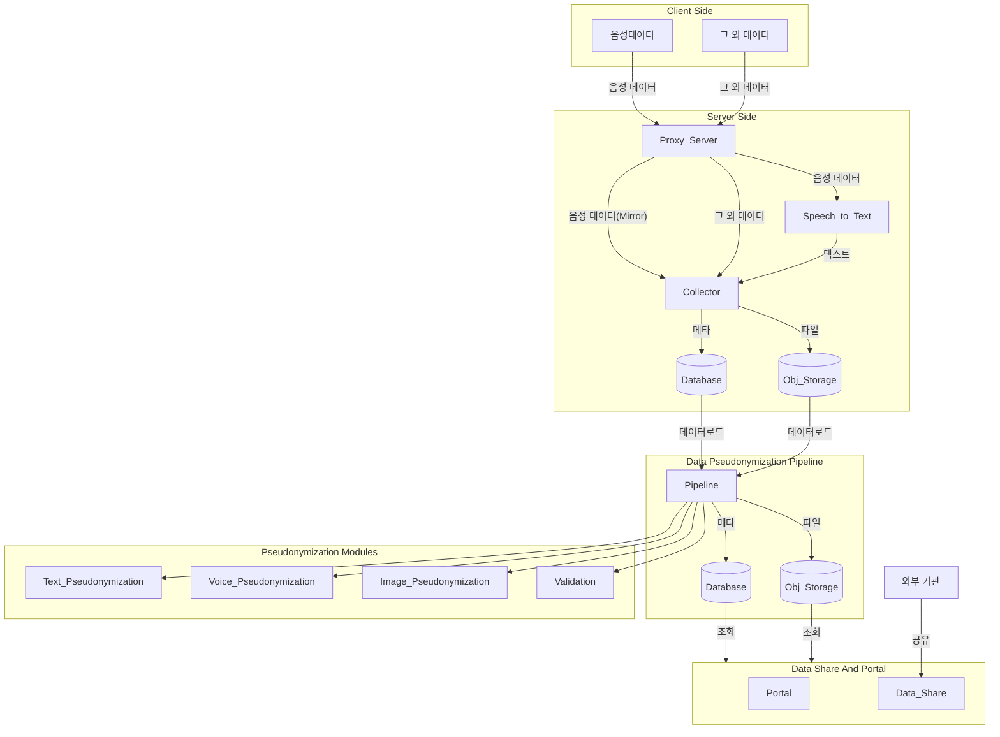

# (1세부) 범죄 의심 정보 내 개인정보 비식별화 기술 개발

> 사업명: 신종보이스피싱 조기탐지기술개발
> 총괄연구개발과제명: (총괄)개인정보 비식별화 기반 신흥 보이스피싱 탐지 기술 개발
> 연구개발과제명: (총괄/1세부) 범죄 의심 정보 내 개인정보 비식별화 기술 개발

## 개요

(총괄/1세부) 범죄 의심 정보 내 개인정보 비식별화 기술 개발 중 모비젠이 담당하는 부분에 대해 설명한다.

## 📋 프로젝트 개요

본 프로젝트는 **스팸, 스미싱, 보이스피싱** 등 범죄 의심정보를 **효율적으로 수집, 처리(비식별화), 공유**하기 위한 시스템입니다.

신고된 데이터를 수집하고, 비식별화를 통해 개인정보를 보호한 후, 필요한 기관에 **안전하고 신뢰할 수 있는 방식**으로 공유하는 통합 솔루션을 제공합니다.

---

## 🎯 주요 목표

### 범죄 의심정보 수집 기술 개발
- 스팸, 스미싱, 보이스피싱 데이터를 각 소스별로 수집하는 REST API
- 스미싱 URL, 악성앱 패키지 등 실시간 공유 대상 데이터 추출

### 대용량 데이터 저장 인프라 구축
- 정형(PostgreSQL) 및 비정형(SeaweedFS) 데이터 저장
- 수평적 확산이 가능한 분산 스토리지 아키텍처
- 작업 큐를 활용한 대용량 데이터 배치 처리 최적화

### 안전한 공유 기술 개발
- 범죄 의심정보를 외부에서 안전하게 공유하는 REST API
- 공유 API별 데이터 필터 및 공유 범위 지정 기능
- 기관별 세밀한 접근 제어 및 감시 로그 관리

---

## 🏗️ 시스템 아키텍처

---

## ✨ 주요 기능

### 1. 데이터 수집 기능
- **REST API 기반 신고 접수**
  - `POST /collector/api/v1/report` (Multipart/form-data)
  - `POST /collector/api/v1/report/base64` (JSON 기반)
- **다양한 파일 형식 지원**
  - 음성: WAV, MP3, M4A
  - 이미지: JPG, PNG
  - 텍스트: JSON, TXT
- **자동 검증 및 정규화**
  - JSON 스키마 기반 메타데이터 검증
  - 파일 형식 검증

### 2. 데이터 비식별화 파이프라인

#### 2.1 비식별화 개요

비식별화(Pseudonymization/Anonymization)는 개인정보를 식별할 수 없도록 변환하는 기술입니다. 

#### 2.2 데이터 별 비식별화

- **데이터 타입 별 데이터 비식별화 모듈 연동**
  - 데이터 타입 분류
  - 비식별화 모듈 연동(HTTP)
  - 비식별화 연동 설정(타임아웃)

#### 2.5 배치 및 이벤트 기반 처리
- **실시간 이벤트 기반**
  - 데이터 수집 완료 시 자동 트리거
  - 지연 시간: 3초 이내
- **정기 배치 처리**
  - 야간 대용량 배치 (새벽 2-4시)
- **상태 추적**
  - PENDING → PROCESSING → COMPLETED

#### 2.6 병렬 처리 최적화
- **다중 워커 아키텍처**
  - 동시 처리 워커 설정 (기본 5개, 최대 20개)
  - 데이터 타입별 특화 워커 (텍스트, 음성, 이미지)
- **동적 워커 조정**
  - 대기 큐 길이에 따른 증감
- **작업 분배**
  - Round-robin 스케줄링

#### 2.7 신뢰성 및 안정성
- **재시도 메커니즘**
  - 최대 3회 재시도
  - 지수 백오프: 1초 → 2초 → 4초
  - 최종 실패 시 관리자 알림
- **감사 로그**
  - 모든 비식별화 작업 기록
  - 처리 전/후 통계 저장
  - 최소 1년 보관

#### 2.8 성능 모니터링
- **처리 성능 지표**
  - 시간당 처리량 (건/시간)
  - 평균 처리 시간
  - 실패율
  - 대기 시간
- **실시간 대시보드**
  - 처리 중의 작업 수
  - 에러율 및 경고

### 3. 접근 통제 및 권한 관리
- **하이브리드 접근 제어 (RBAC + User-Attribute)**
  - 사용자 그룹 및 역할 기반 권한 관리
  - 사용자 속성 기반 세밀한 정책 정의
  - 정책 우선순위 및 거부 우선(Deny-First) 규칙
- **계층적 그룹 관리**
  - 최대 5단계 그룹 계층 구조
  - 권한 자동 상속
- **다중 역할 지원**
  - 사용자/그룹에 여러 역할 동시 할당

### 4. 실시간 데이터 추출
- **정규식 기반 패턴 매칭**
  - HTTP/HTTPS URL 패턴 인식
  - 단축 URL 지원
  - IP 기반 URL 패턴 인식
- **중복 제거 및 검증**
  - 추출된 URL 형식 검증
  - 중복 데이터 자동 제거
- **5분 이내 실시간 공유**
  - 추출 완료 후 즉시 공유 대상에 전달

### 5. 데이터 저장 인프라
- **정형 데이터 (PostgreSQL 14+)**
  - 수집 데이터 테이블
  - 추출 데이터 테이블
  - 통계 테이블
- **비정형 데이터 (SeaweedFS)**
  - S3 호환 오브젝트 스토리지
  - 버킷/연도/월/일/파일명 구조
- **자동 파티셔닝**
  - 월별 시간 기반 파티셔닝
  - 데이터 ID 해시값 기반 샤딩

### 6. 배치 처리 및 스케줄링
- **작업 큐 기반 처리**
  - 작업 상태 관리 (대기, 처리 중, 완료, 실패)
  - 자동 재시도 (최대 3회, 지수 백오프)
- **대용량 데이터 처리**
  - 청크 단위 분할 처리
  - 최대 10개 워커 동시 실행
  - 실시간 진행률 추적
- **Cron 기반 스케줄링**
  - 일일 통계 생성 (매일 새벽 3시)
  - 데이터 아카이빙 (매주 일요일 새벽 2시)

### 7. 데이터셋 관리
- **동적 데이터셋 생성**
  - 날짜 범위, 데이터 타입, 카테고리 기반 필터링
  - AND/OR 복합 조건 지원
- **공유 범위 세밀 제어**
  - 전체 공개 또는 대상 지정 공개
  - 역할/속성 기반 필터링
  - 공유 필드 마스킹
- **데이터셋 다운로드**
  - 백그라운드 압축 처리
  - 대용량 데이터셋 청크 단위 처리
  - 다운로드 상태 추적 (7일 보관, 최대 30일 연장)

### 8. 외부 공유 API
- **보안 통신**
  - HTTPS/TLS 1.3 필수
  - JWT 기반 인증
- **속도 제한 (Rate Limiting)**
  - 분당 100회, 시간당 1,000회 (설정 가능)
  - IP 기반 제한
- **버전 관리**
  - URL 기반 버전 관리 (`/api/v1/`, `/api/v2/`)
  - Swagger/OpenAPI 스펙 제공

### 9. 기관 데이터 수신
- **기관별 맞춤 지원**
  - 표준 JSON 형식 + 커스텀 형식 매핑
  - 기관별 API 키 기반 인증
  - IP 화이트리스트 지원
- **데이터 검증 및 정규화**
  - JSON 스키마 기반 검증
  - 기관별 검증 규칙 적용
  - 중복 데이터 자동 처리
- **수신 이력 추적**
  - 기관별 수신 현황 및 성공률 통계
  - 월간 자동 리포트 생성
  - 최소 3년 보관

### 10. 통계 기능
- **실시간 대시보드**
  - 시간대별 수집 추이 차트
  - 데이터 타입별 분포도
  - 기관별 수신 현황 바 차트
- **자동 리포트 생성**
  - 일일 리포트 (매일 새벽 3시)
  - 주간/월간 리포트
  - HTML 형식 + 자동 배포
- **통계 API**
  - 수집, 추출, 공유, 기관 수신 통계 조회
  - 커스텀 통계 생성 및 저장

### 11. 포탈 알림 시스템
- **다양한 알림 유형**
  - 시스템 알림 (점검, 업데이트)
  - 데이터 처리 알림 (수집, 가명처리, 공유 완료)
  - 보안 알림 (이상 접근, IP 차단)
  - 기관 데이터 수신 알림
  - 통계 리포트 알림
- **우선순위 기반 표시**
  - 긴급(Urgent): 즉시 표시, 빨간색
  - 경고(Warning): 주황색
  - 정보(Info): 회색
- **사용자 맞춤 설정**
  - 알림 유형별 수신 여부
  - 우선순위별 필터링
  - 알림 빈도 제한 설정
- **WebSocket/SSE 기반 실시간 전달**
  - 즉시 알림 수신
  - 브라우저 호환성 고려

---

## 🔒 보안 기능

### 인증 및 인가
- **JWT 기반 인증**
  - 토큰 유효기간: 1시간
  - 리프레시 토큰: 7일
  - Bearer Token 방식 전송
- **실시간 권한 검증**
  - 각 API 호출 시 권한 확인
  - 역할 및 속성 기반 정책 평가

### 보안 정책
- **비밀번호 정책**
  - 최소 8자, 영문/숫자/특수문자 조합
  - 주기적 변경 강제
- **계정 보호**
  - 로그인 실패 5회 시 30분 잠금
  - 접근 실패 10회 시 일시 차단
  - IP 기반 차단 기능
- **OWASP Top 10 대응**
  - SQL Injection 방지
  - XSS 방지
  - CSRF 방지

### 감시 및 감사
- **포괄적 로깅**
  - 모든 API 호출 기록 (최소 2년 보관)
  - 권한 변경 이력 추적 (최소 2년)
  - 공유 이력 기록 (최소 3년)
  - 기관 접근 로그 (최소 3년)
- **실시간 모니터링**
  - 이상 접근 패턴 탐지
  - 대시보드 제공
  - 알림 기능

### 데이터 보호
- **전송 암호화**
  - HTTPS/TLS 1.3 필수
- **저장 암호화**
  - 민감정보 암호화 저장
- **가명처리**
  - 개인정보 식별 불가능 처리

---

## 📊 핵심 지표

| 항목               | 목표값     | 설명                              |
| ------------------ | ---------- | --------------------------------- |
| **실시간 추출**    | 5분 이내   | 수집 데이터 기준 추출 및 공유     |
| **페일오버**       | 30초 이내  | 마스터 장애 시 슬레이브 자동 승격 |
| **병렬 처리**      | 10개 워커  | 동시 배치 처리 작업 수            |
| **재시도**         | 최대 3회   | 실패 작업 자동 재시도             |
| **API Rate Limit** | 분당 100회 | 기관별 요청 제한 (시간당 1,000회) |
| **로그 보관**      | 최소 2-3년 | 감시 및 감사 목적                 |
| **가용성**         | 99.9% 이상 | 목표 시스템 가용성                |

---

## 🏢 주요 사용자

- **개인**: 스팸, 보이스피싱 신고
- **통신사**: 수집된 정보 조회 및 사용
- **경찰청/검찰청**: 범죄 의심정보 공유 및 수사
- **시스템 관리자**: 시스템 운영, 모니터링, 권한 관리

---

## 📦 기술 스택

### 백엔드
- **런타임**: Java/Python/Go 등 (프레임워크별)
- **API 게이트웨이**: 다중 인증 및 속도 제한
- **메시지 큐**: 배치 처리 및 비동기 작업

### 데이터베이스
- **정형 데이터**: PostgreSQL 14+
- **비정형 데이터**: SeaweedFS (S3 호환)
- **캐시**: Redis (선택적)

### 인프라
- **분산 스토리지**: 샤딩 기반 아키텍처 (최소 3개 샤드)
- **복제**: 마스터-슬레이브 복제 (복제 팩터 3)
- **모니터링**: 실시간 대시보드 + Health Check

---

## 📚 문서

- **README.md** (본 문서): 프로젝트 개요 및 빠른 시작

---

## 📈 성능 및 확장성

### 처리 능력
- **일일 처리량**: 수백만 건 데이터 수집 및 처리

### 확장 전략
- **수평적 확장**: 샤드 추가를 통한 데이터 분산

---

## 📞 연락처

- **프로젝트 주관처**: Mobigen Lab
- **이메일**: [contact@mobigen.com](mailto:contact@mobigen.com)
- **GitHub Issues**: 기술적 문제 및 버그 보고

---

## 📄 라이선스

본 프로젝트는 **GNU Affero General Public License v3.0 (AGPLv3)** 으로 배포됩니다.

### 라이선스 요약

- ✅ **자유로운 사용**: 누구나 자유롭게 소프트웨어 사용 가능
- ✅ **자유로운 수정**: 소스코드 수정 및 개선 가능
- ✅ **자유로운 배포**: 수정된 소스코드 배포 가능
- ⚠️ **소스코드 공개 의무**: 상업적 이용 또는 네트워크 서비스 제공 시 소스코드 공개 필수

### 주요 조건

1. **소스코드 공개**: 본 소프트웨어를 기반으로 한 모든 수정 사항은 동일한 AGPLv3 라이선스로 공개해야 합니다.
2. **저작권 표시**: 저작권 및 라이선스 표시를 유지해야 합니다.
3. **라이선스 사본**: 라이선스 전문의 사본을 포함해야 합니다.
4. **네트워크 서비스**: 본 소프트웨어를 네트워크 서비스로 제공하는 경우에도 소스코드 공개 의무가 발생합니다.

### 상업적 사용

상업적 목적으로 사용하면서 소스코드 공개를 원하지 않는 경우, 별도의 상용 라이선스를 취득할 수 있습니다. 자세한 사항은 [contact@mobigen.com](mailto:contact@mobigen.com)으로 문의하시기 바랍니다.

**라이선스 전문**: [GNU AGPLv3](https://www.gnu.org/licenses/agpl-3.0.html)

---

## 🙏 감사의 말

본 프로젝트는 다음 기관의 지원으로 개발되었습니다:
- 과학기술정보통신부

다음은 주관기관과 연구 개발 기관 정보입니다.

- **주관 기관** : 한국인터넷진흥원
  - 연구책임자: 장대일 수석연구원
  - 전자우편: `dale@kisa.or.kr`

- **연구 개발 기관**
    | 기관명   | 책임자 | 직위 | 전자우편                      |
    | -------- | ------ | ---- | ----------------------------- |
    | 리턴제로 | 노정규 | 팀장 | jk@rtzr.ai                    |
    | 딥핑소스 | 고봉경 | 상무 | bongkyung.ko@deepingsource.io |
    | 모비젠   | 박세종 | 팀장 | rhcpn@mobigen.com             |
    | 루테스   | 김기수 | 대표 | kisukim@lutes.co.kr           |

---

**마지막 업데이트**: 2025년 11월 26일
